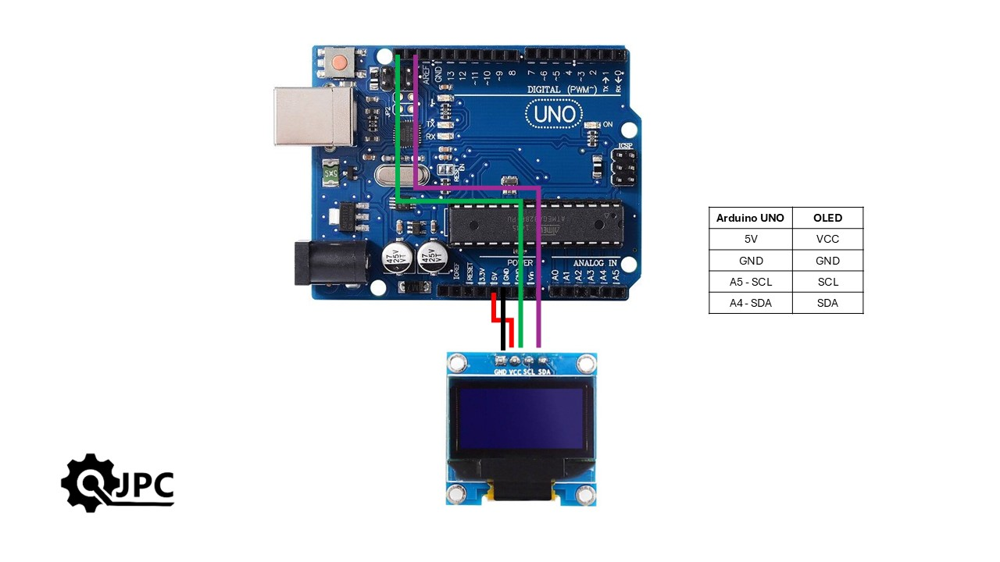

# Connections diagram

Verify these connections are correctly done for arduino board and OLED screen.
These connections works for Arduino Mega and Nano as well.

# Use of python script
- Move image to convert in image folder (only one image per process).
- Execute python script.
- File image_code.h is created in sketch folder.
- Compile and flash code to arduino board.

